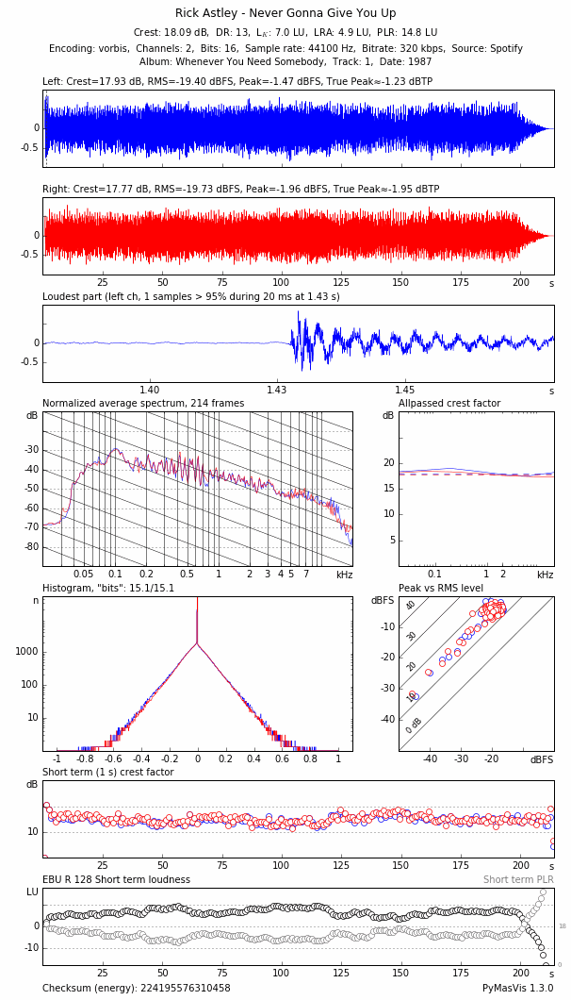

# PyMasVis

PyMasVis is a reimplementation of [MasVis](http://www.lts.a.se/lts/masvis) in Python.

## Usage

Analyze a file by running `python src/analyze.py filename [filename ...]`. The result will be output to `filename-pymasvis.png`. Spotify analysis is done by running `python src/analyze.py -u username -p password spotify_uri`. Result when using Spotify is output to the current working directory.

There is also a web app which enables you to use a webbrowser as a UI. Start it with `python src/webapp.py` and point your browser at http://localhost:5000 it is possible to change the listening address and port with `--host` and `--port`.

## Requirements

The stand alone analyser requires the following components

- FFmpeg
- NumPy
- SciPy
- Matplotlib
- Pillow

The web app requires

- flask
- flask-socketio
- eventlet
- pyzmq

### Python requirements installation

Systems with a package manager might have the required packages available through it. If that is not possible then installation using for example `pip` might be possible.

For standard usage:

	pip install numpy
	pip install scipy
	pip install matplotlib
	pip install pillow

To analyze tracks from Spotify:

	pip install pyspotify

## Notes

PyMasVis suppports all files that FFmpeg supports as PyMasVis uses FFmpeg to convert the file to raw PCM data before analysis.

Histogram is calculated using a maximum of 2^18 bins regardless of real bit depth. The "bits" result is scaled to the presumed real bit depth.

## Troubleshooting

Scipy requires ATLAS/BLAS/LAPACK. Fortran compiler (gfortran).

PySpotify might require a separate installation of libspotify. Libspotify can be downloaded from https://developer.spotify.com/technologies/libspotify/

On Linux the contents of lib/ goes in /usr/local/lib and include/ in /usr/local/include

On OS X libspotify.framework/Versions/XX.XX.XX/Headers/api.h goes into /usr/include/libspotify and libspotify.framework/libspotify is copied to /usr/lib/libspotify.so
