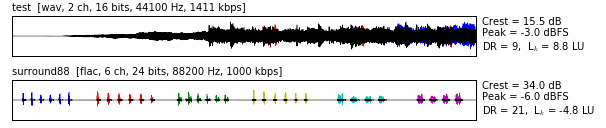
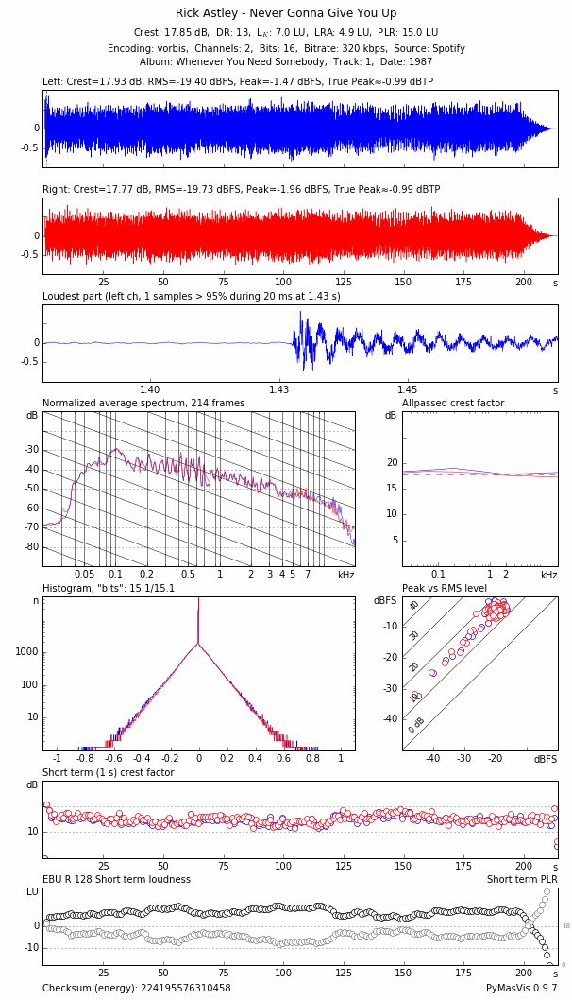

# PyMasVis manual

## Command line options

### analyze.py

    usage: python analyze.py [-h] [--version] [-v] [-d] [-u username] [-p password] [-r]
                      [--destdir destdir] [--update {yes,no,outdated}]
                      [--format {png,jpg}] [--overview]
                      [--overview-mode {dir,flat}]
                      input [input ...]

    Analyze audio file or Spotify URI.

    positional arguments:
      input                 a file, directory or Spotify URI to analyze

    optional arguments:
      -h, --help            show this help message and exit
      --version             show program's version number and exit
      -v, --verbose         verbose messages
      -d, --debug           debug info
      -u username, --username username
                            Spotify username
      -p password, --password password
                            Spotify password
      -r, --recursive       recurse directory tree if input is a directory
      --destdir destdir     destination directory to store analysis in
      --update {yes,no,outdated}
                            choose wheter to update a result image or not,
                            default: yes
      --format {png,jpg}    selects output format, default: png
      --overview            generate overview
      --overview-mode {dir,flat}
                            generate an overview file per directory or one file
                            for all inputs, default: dir

### webapp.py

    usage: python webapp.py [-h] [-d] [--host HOST] [--port PORT]

    Web app for PyMasVis

    optional arguments:
      -h, --help   show this help message and exit
      -d, --debug  debug info
      --host HOST  listen address
      --port PORT  listen port

## Understanding the analyses

PyMasVis can generate two types of analyses, one overview graph for several tracks and one detailed analysis for a single track.

### The overview graph

The overview graph is appropriate for displaying condensed information about an entire album. It shows the waveforms from all channels superimposed on each other. The left channel is shown in blue, the right in red, center in green, LFE in yellow, left surround in cyan and right surround in magenta. Parts where the channels overlap are shown in black. If a lot of color is shown, the channels are quite different.

The crest factor, the level of the highest peak, DR value and relative loudness are shown to the right of each of the graphs. The values can differ from those in the detailed analysis, since all channels are analyzed as one.

### The detailed analysis graph

The detailed analysis graph shows a deeper analysis of a single track. Each graph shows a different aspect of the track, as described below.

#### Header

The header provides various information about the analysed file. The heading shows the artist name and the name of the track if present in the file metadata otherwise the filename is used. The first row shows the crest factor for the whole file, all channels included, DR value, relative loudness, loudness range and peak to loudness ration. The second row contains technical information about the file. This includes the audio encoding used, number of channels, bitdepth, sample rate, bitrate and source medium. The last row shows track metadata if available such as album name, track number and date.

#### Left and Right

The top graphs show the waveforms of the left and right channels, quite like in the overview graph, but separately. The Crest factor, the RMS level, the peak levels and the true peaks of the channels appear above the graphs.

#### The loudest part

In order to show how the strongest part of the track has survived the mastering processing, MasVis attempts to find a strong part of the track and zoom in on that part. Around the selected part, a window of 100 milliseconds is shown. Clipping and/or brickwall limitation is typically revealed here.

The part to show is not selectable by the user, in accordance with the idea that the MasVis graphs should appear the same regardless of who does the analysis. The selection is automatically made by MasVis in the following way:

1. Find the highest sample value in the soundfile
2. Apply a threshold of 95% of the highest sample value.
3. For every place that the signal exceeds the threshold, count how many samples that exceeds the threshold
4. Select the place where the highest number of samples exceeding the threshold occurs.

The sample count for the selected part is displayed above the graph.

#### Normalized average spectrum

This graph shows the average spectrum of the signal. The graph is made by averaging 1-second Blackman windows of the signal. This graph can be used to identify timbral properties of the signal. The sloping solid lines drop by 6 dB/octave and can serve as a reference for the slope of the signal. "Natural sounds" (whatever that is) typically has a slope of around 6 dB/octave, so the slope of the solid lines provides a reference for judging the spectral content of the track.

Even though this graph does not differentiate between mastering processing and the rest of the production, including the instruments it is very useful for comparing different releases of the same album. "Remastered" versions of albums often come with various spectral changes, and these are revealed in the spectrum graph quite clearly when flipping between the two versions.

The spectrum graph is normalized, that is the RMS level of the signal does not affect the graph at all.

#### Allpassed crest factor

This graph probably is the most revealing graph in MasVis. It gives an estimate of how much the crest factor has been lowered by processing of the 2-channel master. In the graph, there are four curves, two red for the right channel, and two blue for the left channel. The dashed line shows the crest factor, ie the same information as above the waveform graphs. The solid line shows the crest factor of the signal after it has passed an allpass filter. This second crest factor is a rough, and typically underestimated value of how large the crest factor was prior to level maximation of the 2-channel master.

At first, it may seem impossible to make such an estimate, but experience shows that the method works. Of course it does not give an exact value of the original crest factor, but it is good enough to tell when the track has been subjected to destructive loudness maximation.

The difference between maximum in the solid line and the dashed line correlates quite well with the amount of crest factor loss that is a result of level maximation of the 2-channel mix.

Here is the method that MasVis uses to make the graph:

1. Draw a dashed line at the crest factor of the track.
2. Run the track through seven different first order allpass filters at 20, 60, 200, 600, 2000, 6000 and 20000 Hz
3. For each of the seven filtered signals, calculate a new crest factor value
4. Plot a solid line representing the crest factors of the seven signals as a function of filter frequency

#### Histogram

In 16 bit audio, such as on a CD, the waveform is represented by 16-bit numbers giving a range of -32768 to + 32767 for the sample values. Some values are more common than others. If for example the track is completely quiet, that is all sample values are 0, the sample value 0 becomes very common. If there is a weak sound, small sample values become common, and if the signal is extremey loud and clipped, the extreme sample values become common instead.

The histogram shows the number of samples for each sample value. That is, a track that contains complete silence will show a peak near 0, and a track that contains clipping will show peaks at the high and/or low end of the histogram.

It can be shown by statistical analysis that the sum of many signals with a reasonably constant amplitude over time will result in a "normal distribution". Such a distibution takes the shape of a parabola if the y axis is logarithmic (as in MasVis). If the signals do not have constant amplitudes, but amplitudes that vary over time, the shape becomes more lika a pyramid with more or less linear slopes.

However, the histogram of the sum of many uncorrelated signal never has abrupt endings. Such abrupt endings only occurs if the signals are correlated (which they almost never are), or if the 2-channel mix has been tampered with.

So, one can expect a histogram with smooth slopes for any mix of several signals, unless the 2-channel mix has been subjected to clipping or brickwall limitation. Thus the histogram is quite useful for revealing clipping and limitation.

The "bits" number above the histogram indicates how many of the 65536 levels that occurs at least once in the soundfile. If all 65536 sample levels occur in the soundfile, the number of bits is shown as 16,0. If only half of them is used, ie 32768 sample levels 15,0 is shown. In mathematical terms, the number that is shown is the 2-logarithm of the number of used sample levels. Somewhat counterintuitive, recordings that has been subjected to mastering processing typically come near to 16,0 "bits", whereas unprocessed recordings at full scale typically reach 14-15 "bits".

#### Peak vs RMS level

This graph is based on 1 second long frames of the signal, and each is represented by a circle in the diagram. For each frame, the RMS and peak levels are calculated, and a circle is plotted in the diagram. Since the peak and RMS levels also give the crest factor, the crest factor for each frame can also be read from the diagram.

This graph is useful for showing the dymamics of the track. If a signal is amplifier, the circles move up towards the right, since both the peak and the RMS levels increase by the same amount. When the circles reach the top, further RMS level increase is only possible if the crest factor is lowered.

Too many modern productions are very crowded in the upper right corner.

#### Short term crest factor

Each of the circles in the Peak vs RMS graph also appears in this graph. Here, the crest factor of the 1-second windows is displayed versus time. It is beneficial to compare this graph with the waveform graphs.

For natural, unprocessed  sounds, the crest factor typically increases a bit when the sound is louder. Loud sound is typically associated with a richer spectrum and an increased number of sound sources, and both these factors increase the crest factor. However, if the 2-channel mix has been subjected to clipping or limitation, the crest factor typically is lowered when the sound becomes loud.

#### EBU R 128 Short term loudness and PLR

Short term loudness and PLR calculated for every second with a 3 second sliding window.

### Glossary

#### Crest factor

The crest factor is the ratio between the peak value and the RMS value during a frame. The crest factor is mostly expressed in decibels (dB), and if so it is the difference between the peak level (in dB) and the RMS level (also in dB). The crest factor is never negative. A sinusoid has a crest factor of 3 dB, and a square wave 0 dB.

#### DR

Dynamic Range calculated according to http://www.dynamicrange.de/sites/default/files/Measuring%20DR%20ENv3.pdf

#### L_k

The relative (-23 LUFS) program loudness as defined by EBU R 128.

#### LRA (Loudness Range)

The distribution of loudness within a programme.

#### PLR (Peak Loudness Ratio)

Ratio of true peak vs loudness.

#### True Peak

The maximum value of the audio signal waveform of a programme in the continuous time domain.

#### Spectrum

A spectrum graph is the result of a Fourier transform (FFT) and shows how the energy in a signal is distributed across different frequencies.

#### RMS and peak values

The RMS (the root of the mean of the squares) value is proportional to the average power of a signal seen over some time. The peak value, on the other hand, is the maximum absolute value within that time period.

#### Frame

When dealing with audio a frame is typically a short or long part of the sound signal. In MasVis frames of 1 second are used to generate the spectrum graph and the short term crest factor graph.

#### Allpass filter

An allpass filter lets all frequencies pass without attenuation or amplification. However, the phase of different frequencies are shifted differently. The result is a signal that sounds very similar to the original signal, but with a quite different waveform.

#### Checksum

Checksums are used frequently to ensure the integrity of data files. Checksum algorithms typically produce results that are quite different even if only a single bit in the data file has changed. The checksum algorithm in MasVis is different in that it remains the same if silence is added to the file.

#### Histogram

A histogram is a diagram that tells "how many of each there are". For example, a simple histogram may show how many students that have passed and failed an exam. This histogram would have only two bars one for the number of students that failed, and one for the number of students who passed. The histogram in MasVis has 65536 bars internally, each representing one level in the 16 bit PCM format. These bars are presented in the histogram graph, showing if some sample level is more common than others.
